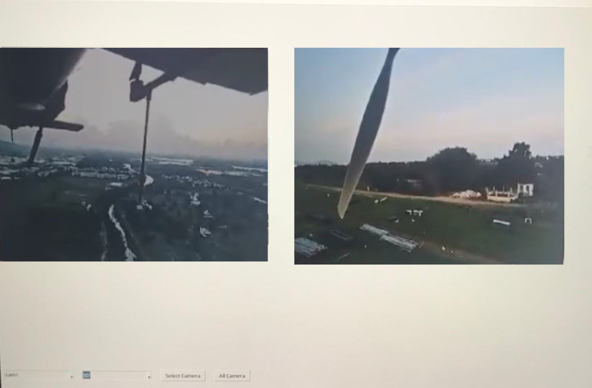

# Live video streamer GUI

## How to run
```
pip install -r requirements.txt

python server_qy_all_camera_gui_terminal.py

```

### Vedio Steamer gui




## Steps of algorithm

1. The application initializes the GUI and sets up sockets for receiving video streams.
2. It spawns threads to handle each camera's video feed concurrently.
3. The main GUI window manages and displays the video feeds in real time.
4. It handles graceful shutdown of video streams when the user closes the application.

## Problem
 
"To stream uninterupted multiple video simultaneously."
